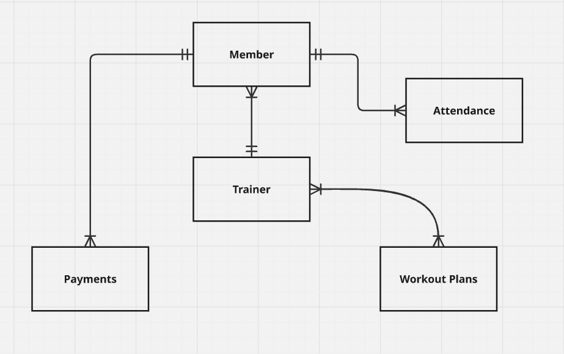

# Design Document

By Rohan Sanjeev Sutar

Video overview: <https://youtu.be/vSu9UtDYnR0>

## Scope

* The purpose of this database is to manage and organize gym operations by storing structured information about members, trainers, workout plans, attendance, and payments.
It enables efficient tracking of memberships, trainer assignments, attendance records, and revenue data using a relational database design.

* Entities Included in the Scope:
   * The database includes the following entities within its scope:
   * Members of the gym, along with their personal details and membership status
   * Trainers who work at the gym and conduct workout plans
   * Workout plans offered by the gym and their assigned trainers
   * Attendance records to track member presence on specific dates
   * Payment records to manage gym membership payments
* These entities represent the core operational data required to run a gym effectively.

## Beyond Scope
* The database does not include:
   * User authentication or login credentials
   * Roles or permissions (admin, staff, trainer access control)
   * Equipment inventory or maintenance tracking
   * Diet plans or nutrition information
   * Detailed workout session metrics (reps, sets, duration)

## Functional Requirements

* Using this database, a user should be able to:
  * Add, update, and retrieve member and trainer information
  * Track active and non-active members
  * Assign trainers to workout plans
  * Record and analyze attendance data
  * Store and analyze payment history and revenue
  * Run analytical queries using JOINs, aggregates, subqueries, views, and indexes
  * Automatically update member status through database triggers

## Beyond Scope
* A user should not be able to:
  * Authenticate users or manage passwords
  * Modify database structure dynamically (e.g., change schema at runtime)
  * Track real-time attendance or biometric data
  * Automatically handle membership expiry or renewal periods
  * Manage multiple trainers per member simultaneously
  * Perform advanced reporting or visual analytics

## Representation

Entities are captured in SQLite tables with the following schema.

### Entities

The database includes the following entities:

#### Members

The `members` table includes:

* `id`, which specifies the unique ID for the member as an `INTEGER`. This column thus has the `PRIMARY KEY` constraint applied.
* `first_name`, which specifies the member's first name as `TEXT`, given `TEXT` is appropriate for name fields.
* `last_name`, which specifies the member's last name. `TEXT` is used for the same reason as `first_name`.
* `age`, which specifies the age of the member as an `INTEGER`, given `INTEGER` is appropriate for name fields. It also checks the required age for a member to join the gym (in this case, >= 14).
* `status`, which specifies the current status of a member being 'Active' or 'Non-Active' as an `TEXT`.

#### Trainers

The `trainers` table includes:

* `id`, which specifies the unique ID for a trainer as an `INTEGER`. This column thus has the `PRIMARY KEY` constraint applied.
* `first_name`, which specifies the trainer's first name as `TEXT`, given `TEXT` is appropriate for name fields.
* `last_name`, which specifies the trainer's last name. `TEXT` is used for the same reason as `first_name`.
* `age`, which specifies the age of the trainer as an `INTEGER`, given `INTEGER` is appropriate for name fields. It also checks the required age for a trainer to join the gym (in this case, >= 18).
* `experience_years`, which specifies the amount of experience a trainer has in fitness industry as `INTEGER`, given `INTEGER` is appropriate for name fields.

#### Workout Plans

The `workout_plans` table includes:

* `id`, which specifies the unique ID for a workout plan as an `INTEGER`. This column thus has the `PRIMARY KEY` constraint applied.
* `plan_name`, which specifies the name of the plan available in the gym as `TEXT`, given `TEXT` is appropriate for name fields.
* `trainer_id`, which specifies the trainer to whom the workout plan is assigned to as `INTEGER`. This column thus has the `FOREIGN KEY` constraint applied, referencing to the `id` column in the `trainers` table to ensure data integrity.

#### Attendance

The `attendance` table includes:

* `id`, which specifies the unique ID for a attendance as an `INTEGER`. This column thus has the `PRIMARY KEY` constraint applied.
* `member_id`, which specifies the member id for tracking their attendance as `INTEGER`. This column thus has the `FOREIGN KEY` constraint applied, referencing to the `id` column in the `members` table to ensure data integrity.
* `date`, which specifies the date at which a member was either (Absent/Present) as `DATE`, which is appropriate for handling dates.
* `status`, which specifies the status of a member either (Absent/Present) on a particular date as `TEXT`.

#### Payments

The `payments` table includes:

* `id`, which specifies the unique ID for a payment made by the member as an `INTEGER`. This column thus has the `PRIMARY KEY` constaint applied.
* `member_id`, which specifies the

### Relationships

The below entity relationship diagram describes the relationships among the entities in the database.

As detailed by the diagram:

* Each `member` in the gym is associated with exactly one `trainer`, determined by the workout plan the member chooses. Therefore, a member has a `one-to-one relationship` with a trainer at any given time.
* A single `trainer` can coach and manage `multiple members` simultaneously.
Hence, the relationship between trainers and members is `one-to-many relationship`, where one trainer may have many members, but each member is assigned to only one trainer.
* A `workout plan` can be conducted by `multiple trainers`, and a trainer can handle multiple workout plans. This forms a `many-to-many relationship`, which is implemented using an intermediate (junction) table to maintain normalization.
* A `member` can make `multiple payments` over time, such as monthly, quarterly, or half-yearly memberships. Each payment record belongs to one specific member, resulting in a `one-to-many relationship` between members and payments.
* Each `member` generates `multiple attendance records` over different days. Every attendance entry corresponds to exactly one member, making this a `one-to-many relationship`.

## Optimizations

* `active_members` View is created to represent `active gym members` in a simplified and reusable way. It avoids repeating filtering logic across multiple queries, improves readability, and allows easy access to frequently used data without duplicating records.

* `activate_member_after_payment` Trigger is implemented to automatically update a member’s status to `Active` when a payment is made. This enforces business rules at the database level, ensures data consistency, and reduces the need for manual updates or application-side logic.

## Limitations

In this section you should answer the following questions:

* Limited Status Automation: While a trigger activates members after payment, the database does not automatically:
      Deactivate members after membership expiry
      Handle overdue payments
  This requires additional logic or triggers.

* Membership validity and expiry, as payments do not explicitly store membership duration or type.
* Detailed attendance behavior, such as multiple check-ins per day, entry/exit times, or session duration.
